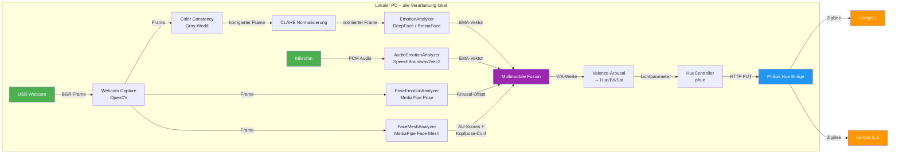

# Technische Spezifikation: Emotion-gesteuerte Philips Hue Lampe

**Projekt:** Smart Light – Lokale KI-Emotionserkennung → Hue-Steuerung  
**Version:** 3.0  
**Datum:** 8. März 2026  
**Autor:** Senior Software-Architekt  
**Changelog:**  
- v3.0: Genauigkeitsverbesserungen – Face Mesh + Action Units, Kopfpose-Kompensation, Color Constancy, erhöhte Analyse-Auflösung  
- v2.0: Multimodales System – EMA-Smoothing, Valence-Arousal, Audio, Pose, Kalibrierung, Burst-Mode  
- v1.0: Initiales System – Webcam + DeepFace + Hue  

---

## Executive Summary

Dieses Dokument spezifiziert ein DIY-Projekt, das eine USB-Webcam, lokales KI-gestütztes Emotionserkennungssystem (DeepFace + optionaler Audio/Pose-Analyse) und eine Philips Hue Bridge kombiniert, um Lampenfarbe und -helligkeit in Echtzeit an den emotionalen Zustand des Nutzers anzupassen. **Alle Verarbeitung erfolgt lokal** – keine Cloud, keine externen APIs.

Version 2.0 erweitert das System um **10 Verbesserungen der Erkennungsqualität**:
- **EMA-Smoothing** über den vollständigen Wahrscheinlichkeitsvektor eliminiert Flackern
- **Valence-Arousal-Modell** ermöglicht kontinuierliche Farbinterpolation statt diskretem Mapping
- **Konfidenz-gewichtetes Alpha** verhindert Überbewertung unsicherer Erkennungen
- **CLAHE-Normalisierung** stabilisiert die Erkennung bei schwierigen Lichtverhältnissen
- **RetinaFace-Detektor** verbessert die Erkennung bei Drehung und Teilverdeckung
- **Trend-Analyse** passt Übergangszeiten an den emotionalen Verlauf an
- **Micro-Expression Burst** erhöht temporär die Analyserate bei Konfidenzsprüngen
- **Audio-Emotionserkennung** via SpeechBrain/wav2vec2 (IEMOCAP-Modell)
- **Körpersprache-Analyse** via MediaPipe Pose (Schulterposition, Kopfhaltung)
- **Nutzer-Kalibrierung** kompensiert individuelle Erkennungsabweichungen

Version 3.0 fügt **4 weitere Genauigkeitsverbesserungen** hinzu:
- **Face Mesh + Action Units** (MediaPipe, 478 Landmarks): AU-basierte Emotionserkennung unterscheidet echte von gestellten Emotionen (z.B. Duchenne-Lächeln via AU6+AU12)
- **Kopfpose-Kompensation** (solvePnP): Schätzt Yaw/Pitch/Roll und reduziert Confidence bei starker Kopfdrehung, wo DeepFace unzuverlässig wird
- **Gray-World Color Constancy**: Korrigiert Farbstich durch die Hue-Lampen selbst – bricht den Feedback-Loop zwischen Lampenfarbe und Kamerabild
- **Erhöhte Analyse-Auflösung** (192→320px) und **strengere Confidence-Schwelle** (0.45→0.55) reduzieren Rauschen signifikant

**Technologie-Stack:**  
- Python 3.10+, OpenCV (Webcam-Capture), DeepFace/RetinaFace (Video-Emotionserkennung), phue (Hue-Bridge-API)  
- SpeechBrain + PyTorch (Audio), MediaPipe (Pose + Face Mesh), NumPy/SciPy (Signalverarbeitung)  
- Optional: CUDA/cuDNN für GPU-Beschleunigung, Flask für Web-UI  

**Hardware-Anforderung:** Standard-PC (Windows/Linux), USB-Webcam, Mikrofon (optional), Philips Hue Bridge + beliebig viele Lampen.

---

## 1. Systemarchitektur

### 1.1 Komponentendiagramm



### 1.2 Datenfluss

```
┌──────────┐  30 FPS   ┌──────────────┐  Gray-World  ┌──────────────┐  jeden n-ten   ┌────────────────┐
│  Webcam  │──────────►│Color Constancy│─────+CLAHE─►│ CLAHE-Norm.    │───Frame────────►│  EmotionAnal.  │
└──────────┘           └──────────────┘              └──────────────┘                 │  (DeepFace)    │
                                                                             └───────┬────────┘
┌──────────┐  2s-Chunks ┌──────────────┐                                       │
│  Mikrofon│───────────►│ AudioAnal.   │                                       │ EMA-Vektor
└──────────┘            │ (SpeechBrain)│──────────────────────►│
                        └──────────────┘                       ▼
┌──────────┐  jeden 2n  ┌──────────────┐              ┌────────────────┐
│  Webcam  │───Frame───►│  PoseAnal.   │──Arousal────►│    Fusion      │
└──────────┘            │ (MediaPipe)  │   Offset     │ V/A → Hue/Bri  │
                        └──────────────┘              └───┬────────────┘
┌──────────┐  jeden n   ┌──────────────┐    ▲         │ HTTP PUT
│  Webcam  │───Frame───►│ FaceMeshAnal.│────┘         ▼
└──────────┘            │ (Face Mesh)  │AU-Scores   ┌────────────────┐
                        │ Kopfpose-Conf│            │  Hue Bridge    │
                        └──────────────┘            └───────┬────────┘
                                                            │ ZigBee
                                                      Lampe(n)
```

**Ablauf pro Zyklus:**

1. OpenCV greift Frame von Webcam (30 FPS Target).
2. **Gray-World Color Constancy** korrigiert Farbstich durch Hue-Lampen-Reflexion.
3. CLAHE-Normalisierung gleicht ungleichmäßige Beleuchtung aus.
4. Jeden n-ten Frame (Default: 7) analysiert DeepFace – bei Burst-Trigger häufiger.
5. DeepFace liefert 7-Emotions-Wahrscheinlichkeitsvektor → EMA-Update mit konfidenz-gewichtetem Alpha.
6. **FaceMeshAnalyzer** extrahiert parallel Action Units (AU6, AU12 etc.) aus 478 Landmarks → AU-basierte Emotionsscores.
7. **Kopfpose-Schätzung** (solvePnP) liefert Yaw/Pitch/Roll → Confidence-Attenuation bei starker Drehung.
8. SpeechBrain analysiert parallel 2s-Mikrofon-Chunks → eigener EMA-Vektor.
9. MediaPipe Pose extrahiert Schulter/Kopf-Signale → Arousal-Offset.
10. Fusion kombiniert Video-EMA + Audio-EMA + **Face-Mesh-AU-Scores** + Pose-Offset mit konfigurierbaren Gewichten.
11. Valence-Arousal-Modell interpoliert fusionierte Emotionen in Hue/Bri/Sat.
12. phue sendet HTTP PUT an Bridge; Trend-Analyse passt Übergangszeit an.
13. Fallback: Kein Gesicht → EMA decayt langsam Richtung neutral.

### 1.3 Threading-Modell

```
Main Thread          ──► OpenCV Capture + Fusion + Hue-Steuerung + Overlay
Analysis Thread      ──► DeepFace Inference (CPU/GPU)  [EmotionAnalyzer]
Audio Thread         ──► SpeechBrain Inference + Mikrofon-Recording  [AudioEmotionAnalyzer]
Pose Thread          ──► MediaPipe Pose Inference  [PoseEmotionAnalyzer]
FaceMesh Thread      ──► MediaPipe Face Mesh + AU-Extraktion + Kopfpose  [FaceMeshAnalyzer]
```

Fünf Threads, jeweils über eine Thread-sichere `queue.Queue(maxsize=1)` verbunden. Das `maxsize=1`-Prinzip garantiert, dass stets der aktuellste Frame verarbeitet wird – ältere Frames werden verworfen. Ergebnisse werden per `threading.Lock` thread-safe abgerufen. Alle Analyse-Threads sind Daemon-Threads und enden automatisch beim Programmende.

Die Module `audio_analyzer.py` und `pose_analyzer.py` degradieren graceful: Wenn die Abhängigkeiten (SpeechBrain/MediaPipe) nicht installiert sind, wird der Import-Fehler abgefangen und der jeweilige Analyzer deaktiviert.

---

## 2. Abhängigkeiten & Installation

### 2.1 Python-Pakete

```
# requirements.txt
opencv-python>=4.8.0      # Webcam-Capture, CLAHE, Bildverarbeitung
deepface>=0.0.93          # Video-Emotionserkennung (nutzt TensorFlow)
phue>=1.1                 # Philips Hue Bridge API
tensorflow>=2.15.0        # DeepFace Laufzeitbibliothek
tf-keras>=2.15.0          # Keras-Kompatibilitätsschicht
numpy>=1.24.0             # Numerik, EMA-Berechnungen
flask>=3.0.0              # Optional: Web-UI
retina-face>=0.0.17       # RetinaFace-Gesichtsdetektor
sounddevice>=0.4.6        # Mikrofon-Capture (Audio-Modul)
speechbrain>=1.0.0        # Audio-Emotionserkennung (wav2vec2-IEMOCAP)
torch>=2.0.0              # PyTorch-Laufzeit für SpeechBrain
mediapipe>=0.10.0         # Körpersprache-Analyse (Pose)
```

**Modell-Downloads beim Erststart:**

| Modell | Größe | Speicherort |
|--------|-------|-------------|
| RetinaFace | ~120 MB | `~/.deepface/weights/retinaface.h5` |
| DeepFace Emotion | ~30 MB | `~/.deepface/weights/` |
| SpeechBrain wav2vec2-IEMOCAP | ~400 MB | `~/.cache/huggingface/` |

> **Hinweis:** DeepFace nutzt intern TensorFlow/Keras. Für GPU-Beschleunigung muss `tensorflow[and-cuda]` installiert werden (Details in Abschnitt 5).

### 2.2 Installation

```bash
# 1. Virtuelle Umgebung erstellen
python -m venv .venv
# Windows:
.venv\Scripts\activate
# Linux:
# source .venv/bin/activate

# 2. Abhängigkeiten installieren
pip install -r requirements.txt

# 3. Für GPU-Beschleunigung (optional, NVIDIA RTX):
pip install tensorflow[and-cuda]
```

### 2.3 Philips Hue Bridge Pairing

Die Hue Bridge muss einmalig mit dem PC gepaart werden. Die phue-Bibliothek übernimmt die Registrierung automatisch beim ersten Verbindungsversuch.

**Schritte:**

1. Hue Bridge im lokalen Netzwerk identifizieren:
   ```python
   # Bridge-IP finden (Option A: mDNS/UPnP)
   # Alternativ: Im Router nachsehen oder https://discovery.meethue.com (einmalig)
   from phue import Bridge
   b = Bridge('192.168.1.XXX')  # IP der Bridge einsetzen
   ```

2. **Physischen Button auf der Hue Bridge drücken** (innerhalb von 30 Sekunden).

3. Erneut verbinden – phue erstellt automatisch `~/.python_hue` mit dem API-Key:
   ```python
   b.connect()
   print(b.get_light_objects('name'))  # Verfügbare Lampen auflisten
   ```

4. Lampen-ID notieren (wird in der Konfiguration referenziert).

> **Wichtig:** Die Bridge-IP kann sich ändern. Empfehlung: Statische IP im Router vergeben oder per mDNS (`philips-hue.local`) auflösen.

---

## 3. Kernmodule

### 3.1 Konfiguration & Emotion-Mapping

Die gesamte Konfiguration liegt in `config.py`. Abschnitte:

**Hardware & Capture:**
```python
WEBCAM_INDEX = 0
HUE_BRIDGE_IP = "192.168.178.20"
HUE_LIGHT_IDS = [2, 3, 4, 6]   # Multi-Lampen-Support
FRAME_WIDTH, FRAME_HEIGHT = 640, 480
ANALYSIS_EVERY_N_FRAMES = 5
CAMERA_BUFFER_SIZE = 1          # Immer den aktuellsten Frame
```

**DeepFace & Bildverarbeitung:**
```python
DETECTOR_BACKEND = "retinaface"  # Robuster als opencv, besonders bei Teilverdeckung
MIN_CONFIDENCE = 0.45
ANALYSIS_FRAME_SIZE = 224        # Frame-Downscaling vor Analyse (~60% schneller)
CLAHE_CLIP_LIMIT = 2.0           # CLAHE Beleuchtungsnormalisierung (0 = aus)
```

**EMA-Smoothing:**
```python
EMA_ALPHA = 0.15        # Basis-Gewicht; effektiv: EMA_ALPHA * confidence
EMA_MIN_WEIGHT = 0.05   # Emotionen unter diesem Wert werden beim Blending ignoriert
FALLBACK_DECAY = 0.08   # Drift Richtung neutral bei fehlendem Gesicht
```

**Valence-Arousal-Modell:**
```python
USE_VALENCE_AROUSAL = True

VALENCE_AROUSAL_MAP = {
    "happy":    {"valence":  0.9, "arousal":  0.5},
    "sad":      {"valence": -0.8, "arousal": -0.7},
    "angry":    {"valence": -0.9, "arousal":  1.0},
    "fear":     {"valence": -0.7, "arousal":  0.8},
    "surprise": {"valence":  0.3, "arousal":  0.9},
    "disgust":  {"valence": -0.6, "arousal":  0.2},
    "neutral":  {"valence":  0.0, "arousal":  0.0},
}

VA_HUE_NEGATIVE = 47000  # Blau   (valence = -1.0)
VA_HUE_NEUTRAL  = 14000  # Warmweiß (valence = 0)
VA_HUE_POSITIVE = 20000  # Warmgelb (valence = +1.0)
VA_BRI_LOW, VA_BRI_HIGH = 80, 240
VA_SAT_LOW, VA_SAT_HIGH = 60, 240
```

**Erweiterte Analyse:**
```python
TREND_INFLUENCE = 0.3          # Einfluss Valence-Trend auf Transition-Zeit
BURST_CONFIDENCE_DELTA = 0.25  # Schwelle für Micro-Expression Burst
BURST_FRAMES = 5               # Frames im Burst-Modus
```

**Audio & Pose & Kalibrierung:**
```python
USE_AUDIO = True
AUDIO_WEIGHT = 0.35            # 35% Audio, 65% Video in der Fusion
AUDIO_EMA_ALPHA = 0.12

USE_POSE = True
POSE_WEIGHT = 0.2              # Einfluss des Arousal-Offsets auf Helligkeit

CALIBRATION_FILE = "calibration_default.json"
CALIBRATION_SECONDS_PER_EMOTION = 10
```

**Direktes Fallback-Mapping (wenn `USE_VALENCE_AROUSAL = False`):**

| Emotion    | Hue   | Bri | Sat | Farbe           | Wirkung               |
|-----------|-------|-----|-----|-----------------|------------------------|
| happy     | 20000 | 200 | 200 | Warm-Gelb       | Energetisch, fröhlich  |
| sad       | 47000 | 100 | 180 | Dimm-Blau       | Ruhig, gedämpft        |
| angry     | 65535 | 220 | 254 | Intensiv-Rot    | Alarmierend, stark     |
| fear      | 50000 | 120 | 200 | Lila            | Mysteriös, unruhig     |
| surprise  | 10000 | 254 | 230 | Helles Orange   | Aufregend, lebendig    |
| disgust   | 25500 | 130 | 220 | Grün            | Unbehaglich            |
| neutral   | 14000 | 160 | 120 | Warmweiß        | Entspannt, normal      |
| *Fallback*| 14000 | 140 |  80 | Gedämpft Weiß   | Keine Erkennung        |

### 3.2 Webcam-Capture-Modul

```python
# capture.py
"""Webcam-Capture mit OpenCV – liefert Frames via Callback."""

import cv2
import threading
import time
from config import WEBCAM_INDEX, FRAME_WIDTH, FRAME_HEIGHT, TARGET_FPS


class WebcamCapture:
    """Thread-sichere Webcam-Capture-Klasse."""

    def __init__(self):
        self.cap = cv2.VideoCapture(WEBCAM_INDEX)
        self.cap.set(cv2.CAP_PROP_FRAME_WIDTH, FRAME_WIDTH)
        self.cap.set(cv2.CAP_PROP_FRAME_HEIGHT, FRAME_HEIGHT)
        self.cap.set(cv2.CAP_PROP_FPS, TARGET_FPS)

        if not self.cap.isOpened():
            raise RuntimeError(f"Webcam {WEBCAM_INDEX} konnte nicht geöffnet werden")

        self._frame = None
        self._lock = threading.Lock()
        self._running = False
        self._thread = None

    def start(self):
        """Startet den Capture-Thread."""
        self._running = True
        self._thread = threading.Thread(target=self._capture_loop, daemon=True)
        self._thread.start()
        return self

    def _capture_loop(self):
        while self._running:
            ret, frame = self.cap.read()
            if ret:
                with self._lock:
                    self._frame = frame
            time.sleep(1 / TARGET_FPS)

    def read(self):
        """Liefert den aktuellsten Frame (Thread-sicher)."""
        with self._lock:
            return self._frame.copy() if self._frame is not None else None

    def stop(self):
        """Stoppt Capture und gibt Ressourcen frei."""
        self._running = False
        if self._thread:
            self._thread.join(timeout=3)
        self.cap.release()
```

### 3.3 Emotion-Analyse-Modul

```python
# analyzer.py
"""Emotionserkennung via DeepFace – vollständig lokal."""

import threading
import queue
import time
from deepface import DeepFace
from config import DETECTOR_BACKEND, MIN_CONFIDENCE, FALLBACK_AFTER_SECONDS


class EmotionAnalyzer:
    """Asynchrone Emotionserkennung in separatem Thread."""

    def __init__(self):
        self._input_queue = queue.Queue(maxsize=1)  # Nur neuester Frame
        self._result = {"emotion": "neutral", "confidence": 0.0, "faces": []}
        self._lock = threading.Lock()
        self._running = False
        self._last_detection_time = time.time()

        # Modell beim ersten Aufruf laden (Warm-up)
        self._model_loaded = False

    def start(self):
        """Startet den Analyse-Thread."""
        self._running = True
        thread = threading.Thread(target=self._analysis_loop, daemon=True)
        thread.start()
        return self

    def submit_frame(self, frame):
        """Übergibt einen Frame zur Analyse (non-blocking, überschreibt alten)."""
        try:
            # Queue leeren falls noch ein alter Frame drin ist
            while not self._input_queue.empty():
                self._input_queue.get_nowait()
            self._input_queue.put_nowait(frame)
        except queue.Full:
            pass  # Frame droppen wenn Queue voll

    def _analysis_loop(self):
        while self._running:
            try:
                frame = self._input_queue.get(timeout=1)
            except queue.Empty:
                self._check_fallback()
                continue

            try:
                results = DeepFace.analyze(
                    img_path=frame,
                    actions=["emotion"],
                    detector_backend=DETECTOR_BACKEND,
                    enforce_detection=False,
                    silent=True,
                )
                self._model_loaded = True

                if isinstance(results, list) and len(results) > 0:
                    face = results[0]
                    dominant = face.get("dominant_emotion", "neutral")
                    confidence = face.get("emotion", {}).get(dominant, 0.0) / 100.0

                    if confidence >= MIN_CONFIDENCE:
                        with self._lock:
                            self._result = {
                                "emotion": dominant,
                                "confidence": confidence,
                                "faces": results,
                            }
                            self._last_detection_time = time.time()
                else:
                    self._check_fallback()

            except Exception:
                self._check_fallback()

    def _check_fallback(self):
        """Setzt auf neutral zurück wenn zu lange kein Gesicht erkannt."""
        if time.time() - self._last_detection_time > FALLBACK_AFTER_SECONDS:
            with self._lock:
                self._result = {
                    "emotion": "neutral",
                    "confidence": 0.0,
                    "faces": [],
                }

    def get_result(self):
        """Liefert das aktuelle Analyse-Ergebnis (Thread-sicher)."""
        with self._lock:
            return self._result.copy()

    def stop(self):
        self._running = False
```

### 3.4 Hue-Controller-Modul

```python
# hue_controller.py
"""Philips Hue Lampensteuerung via phue."""

import threading
import logging
from phue import Bridge
from config import HUE_BRIDGE_IP, HUE_LIGHT_ID, TRANSITION_TIME, FALLBACK_LIGHT

logger = logging.getLogger(__name__)


class HueController:
    """Thread-sichere Hue-Lampensteuerung mit Debouncing."""

    def __init__(self):
        self.bridge = Bridge(HUE_BRIDGE_IP)
        self.bridge.connect()
        self.light_id = HUE_LIGHT_ID
        self._last_command = {}
        self._lock = threading.Lock()

        # Lampe einschalten
        self.bridge.set_light(self.light_id, "on", True)
        logger.info(f"Hue Bridge verbunden, Lampe {self.light_id} aktiviert")

    def set_emotion_light(self, hue: int, bri: int, sat: int,
                          transition: int = TRANSITION_TIME):
        """Setzt Lampenfarbe mit Debouncing (ignoriert identische Befehle)."""
        command = {"hue": hue, "bri": bri, "sat": sat}

        with self._lock:
            if command == self._last_command:
                return  # Keine Änderung nötig
            self._last_command = command

        try:
            self.bridge.set_light(
                self.light_id,
                {
                    "hue": hue,
                    "bri": bri,
                    "sat": sat,
                    "transitiontime": transition,
                },
            )
            logger.debug(f"Hue gesetzt: hue={hue}, bri={bri}, sat={sat}")
        except Exception as e:
            logger.error(f"Hue-Fehler: {e}")

    def set_fallback(self):
        """Setzt die Lampe auf neutrales Fallback-Licht."""
        fb = FALLBACK_LIGHT
        self.set_emotion_light(fb["hue"], fb["bri"], fb["sat"])

    def turn_off(self):
        """Schaltet die Lampe aus."""
        try:
            self.bridge.set_light(self.light_id, "on", False)
        except Exception as e:
            logger.error(f"Lampe ausschalten fehlgeschlagen: {e}")
```

---

## 4. Vollständiges Beispiel-Skript

```python
#!/usr/bin/env python3
# main.py
"""
Emotion-gesteuerte Philips Hue Lampe – Hauptprogramm.
Erkennt Emotionen via Webcam und steuert Hue-Licht in Echtzeit.
Alle Verarbeitung erfolgt lokal.
"""

import cv2
import time
import sys
import logging
import threading
import queue
from deepface import DeepFace
from phue import Bridge

# ──────────────────────── Konfiguration ────────────────────────
WEBCAM_INDEX = 0
HUE_BRIDGE_IP = "192.168.1.100"     # Eigene Bridge-IP einsetzen
HUE_LIGHT_ID = 1                     # Eigene Lampen-ID einsetzen

FRAME_WIDTH, FRAME_HEIGHT = 640, 480
ANALYSIS_EVERY_N = 3                  # Nur jeder n-te Frame analysiert
DETECTOR_BACKEND = "opencv"
MIN_CONFIDENCE = 0.30
TRANSITION_TIME = 15                  # 1.5 Sekunden Fade
FALLBACK_TIMEOUT = 5                  # Sekunden ohne Gesicht → Fallback

EMOTION_MAP = {
    "happy":    {"hue": 20000, "bri": 200, "sat": 200},
    "sad":      {"hue": 47000, "bri": 100, "sat": 180},
    "angry":    {"hue": 65535, "bri": 220, "sat": 254},
    "fear":     {"hue": 50000, "bri": 120, "sat": 200},
    "surprise": {"hue": 10000, "bri": 254, "sat": 230},
    "disgust":  {"hue": 25500, "bri": 130, "sat": 220},
    "neutral":  {"hue": 14000, "bri": 160, "sat": 120},
}
FALLBACK = {"hue": 14000, "bri": 140, "sat": 80}

logging.basicConfig(level=logging.INFO,
                    format="%(asctime)s [%(levelname)s] %(message)s")
log = logging.getLogger("emotion-light")

# ──────────────────── Hue Controller ───────────────────────────
class HueCtrl:
    def __init__(self, ip, light_id):
        self.bridge = Bridge(ip)
        self.bridge.connect()
        self.lid = light_id
        self._last = {}
        self.bridge.set_light(self.lid, "on", True)
        log.info("Hue Bridge verbunden.")

    def apply(self, params, transition=TRANSITION_TIME):
        cmd = {k: params[k] for k in ("hue", "bri", "sat")}
        if cmd == self._last:
            return
        self._last = cmd
        cmd["transitiontime"] = transition
        try:
            self.bridge.set_light(self.lid, cmd)
        except Exception as e:
            log.error(f"Hue Fehler: {e}")

    def off(self):
        self.bridge.set_light(self.lid, "on", False)


# ──────────────── Emotion Analyzer (Thread) ────────────────────
class Analyzer:
    def __init__(self):
        self._q = queue.Queue(maxsize=1)
        self._result = {"emotion": "neutral", "confidence": 0.0}
        self._lock = threading.Lock()
        self._running = False
        self._last_face = time.time()

    def start(self):
        self._running = True
        threading.Thread(target=self._loop, daemon=True).start()

    def submit(self, frame):
        try:
            while not self._q.empty():
                self._q.get_nowait()
            self._q.put_nowait(frame)
        except queue.Full:
            pass

    def _loop(self):
        while self._running:
            try:
                frame = self._q.get(timeout=1.0)
            except queue.Empty:
                self._maybe_fallback()
                continue
            try:
                results = DeepFace.analyze(
                    img_path=frame,
                    actions=["emotion"],
                    detector_backend=DETECTOR_BACKEND,
                    enforce_detection=False,
                    silent=True,
                )
                if isinstance(results, list) and results:
                    r = results[0]
                    emo = r.get("dominant_emotion", "neutral")
                    conf = r.get("emotion", {}).get(emo, 0.0) / 100.0
                    if conf >= MIN_CONFIDENCE:
                        with self._lock:
                            self._result = {"emotion": emo, "confidence": conf}
                            self._last_face = time.time()
                    else:
                        self._maybe_fallback()
                else:
                    self._maybe_fallback()
            except Exception:
                self._maybe_fallback()

    def _maybe_fallback(self):
        if time.time() - self._last_face > FALLBACK_TIMEOUT:
            with self._lock:
                self._result = {"emotion": "neutral", "confidence": 0.0}

    def get(self):
        with self._lock:
            return self._result.copy()

    def stop(self):
        self._running = False


# ──────────────────────── Main Loop ────────────────────────────
def main():
    # --- Webcam ---
    cap = cv2.VideoCapture(WEBCAM_INDEX)
    cap.set(cv2.CAP_PROP_FRAME_WIDTH, FRAME_WIDTH)
    cap.set(cv2.CAP_PROP_FRAME_HEIGHT, FRAME_HEIGHT)
    if not cap.isOpened():
        log.error("Webcam nicht verfügbar!")
        sys.exit(1)
    log.info(f"Webcam {WEBCAM_INDEX} geöffnet ({FRAME_WIDTH}x{FRAME_HEIGHT})")

    # --- Hue ---
    try:
        hue = HueCtrl(HUE_BRIDGE_IP, HUE_LIGHT_ID)
    except Exception as e:
        log.error(f"Hue-Bridge-Verbindung fehlgeschlagen: {e}")
        log.error("Tipp: Bridge-Button drücken und erneut starten.")
        cap.release()
        sys.exit(1)

    # --- Analyzer ---
    analyzer = Analyzer()
    analyzer.start()
    log.info("Emotion-Analyse gestartet. Drücke 'q' zum Beenden.")

    frame_count = 0
    current_emotion = "neutral"

    try:
        while True:
            ret, frame = cap.read()
            if not ret:
                log.warning("Frame-Fehler, überspringe...")
                continue

            frame_count += 1

            # Nur jeden n-ten Frame analysieren
            if frame_count % ANALYSIS_EVERY_N == 0:
                analyzer.submit(frame.copy())

            # Aktuelles Ergebnis holen
            result = analyzer.get()
            current_emotion = result["emotion"]
            confidence = result["confidence"]

            # Hue aktualisieren
            params = EMOTION_MAP.get(current_emotion, FALLBACK)
            if confidence == 0.0:
                hue.apply(FALLBACK)
            else:
                hue.apply(params)

            # Overlay auf Frame zeichnen
            color = (0, 255, 0) if confidence > 0 else (0, 0, 255)
            text = f"{current_emotion} ({confidence:.0%})"
            cv2.putText(frame, text, (20, 40),
                        cv2.FONT_HERSHEY_SIMPLEX, 1.0, color, 2)

            hue_val = params.get("hue", 0)
            cv2.putText(frame, f"Hue:{hue_val} Bri:{params.get('bri',0)}",
                        (20, 80), cv2.FONT_HERSHEY_SIMPLEX, 0.6,
                        (200, 200, 200), 1)

            cv2.imshow("Emotion Light", frame)

            if cv2.waitKey(1) & 0xFF == ord("q"):
                break

    except KeyboardInterrupt:
        log.info("Keyboard-Interrupt empfangen.")
    finally:
        log.info("Aufräumen...")
        analyzer.stop()
        hue.apply(FALLBACK, transition=10)
        time.sleep(1)
        cap.release()
        cv2.destroyAllWindows()
        log.info("Beendet.")


if __name__ == "__main__":
    main()
```

**Zeilenanzahl:** ~180 Zeilen – vollständig lauffähig.

---

## 5. Optimierungen

---

## 4b. Neue Module (v2.0)

### 4b.1 EmotionAnalyzer (main.py) – EMA-Smoothing

Der `EmotionAnalyzer` verarbeitet den vollständigen 7-Emotions-Wahrscheinlichkeitsvektor von DeepFace statt nur das dominante Label:

```
DeepFace liefert: {"happy": 72.3, "neutral": 18.1, "sad": 5.2, ...}  (Summe ~100)

→ Wird als normierter Vektor p behandelt (Summe = 1.0)
→ EMA-Update: ema = (1 - α_eff) * ema + α_eff * p
   wobei α_eff = EMA_ALPHA * confidence  (confidence = max(p))

→ Farbblending: Hue/Bri/Sat wird als gewichtete Summe aller Emotionen berechnet
```

**Vorteile gegenüber Counter-basiertem Voting (v1.0):**
- Nutzt 100% der Informationen (7 Scores statt 1 Label)
- Glatte Übergänge durch EMA (kein Flackern bei Gleichstand)
- Konfidenz-gewichtetes Alpha: schlechte Erkennungen haben weniger Einfluss
- FALLBACK_DECAY lässt EMA langsam zerfallen statt hartem Reset

### 4b.2 Valence-Arousal-Modell (main.py) – `valence_arousal_to_light()`

Statt diskreter Emotion→Farbe-Tabelle nutzt v2.0 ein kontinuierliches 2D-Modell:

```
Valence (x-Achse):  -1.0 (negativ) ──────── 0 (neutral) ──────── +1.0 (positiv)
Arousal (y-Achse):  -1.0 (passiv)  ──────────────────────────── +1.0 (aktiv)

Hue:        lineare Interpolation Blau ↔ Warmweiß ↔ Warmgelb
Brightness: lineare Interpolation BRI_LOW ↔ BRI_HIGH (nach Arousal)
Saturation: lineare Interpolation SAT_LOW ↔ SAT_HIGH (nach Arousal)
```

Der EMA-Vektor wird via `VALENCE_AROUSAL_MAP` in v/a-Koordinaten übersetzt (gewichtetes Mittel).

### 4b.3 AudioEmotionAnalyzer (audio_analyzer.py)

| Aspekt | Implementierung |
|--------|----------------|
| Modell | `speechbrain/emotion-recognition-wav2vec2-IEMOCAP` |
| Eingabe | 2s-PCM-Chunks (16kHz, Mono) via `sounddevice` |
| Labels | `neu→neutral, hap→happy, sad→sad, ang→angry` + Fallbacks |
| Smoothing | Eigener EMA-Vektor mit `AUDIO_EMA_ALPHA = 0.12` |
| Thread | Daemon-Thread mit Queue(maxsize=1) |
| Stille | Chunks unter RMS-Schwelle werden übersprungen |

### 4b.4 PoseEmotionAnalyzer (pose_analyzer.py)

Extrahiert 3 Arousal-Signale aus MediaPipe Pose-Landmarks:

| Signal | Landmarks | Gewicht | Interpretation |
|--------|-----------|---------|----------------|
| Schulterhoehe | 11, 12 (Schultern) | 40% | Hoch = Stress = mehr Arousal |
| Kopfneigung | 0 (Nase) vs. Schultern | 35% | Tief = Müdigkeit = weniger Arousal |
| Schulter-Asymmetrie | 11, 12 | 25% | Ungleich = Unruhe = mehr Arousal |

Liefert einen `arousal_offset` (−1.0 bis +1.0) der die Helligkeit der Lampe anpasst.

### 4b.5 Kalibrierung (calibration.py)

Interaktive 2-Minuten-Kalibrierung (7 Emotionen × 10s):

```
1. Countdown 3s pro Emotion
2. Nutzer zeigt Emotion → DeepFace sammelt Frames
3. Offset = Erwartung(100% für aktuelle Emotion) − Durchschnitt(gemessene Scores)
4. Offsets werden als JSON gespeichert
5. main.py lädt JSON beim Start und addiert Offsets auf jeden Analyse-Frame
```

**Starten:** `python main.py --calibrate`  
**Datei:** `calibration_default.json` (überschreibbar mit `--calibration-file PATH`)

### 4b.6 Trend-Analyse & Burst-Modus (main.py)

**Trend:** Vergleicht aktuelle Valence mit der EMA-gewichteten historischen Valence. Bei fallender Stimmung (trend_v < 0) wird `TRANSITION_TIME` proportional verlängert (sanfterer Übergang). Bei steigender Stimmung bleibt die normale Zeit.

**Burst-Modus:** Wenn `confidence > avg_confidence + BURST_CONFIDENCE_DELTA`, wechselt der Analyzer für `BURST_FRAMES` Analyse-Zyklen in den Burst-Modus: Frames werden unabhängig vom `ANALYSIS_EVERY_N_FRAMES`-Zähler sofort analysiert. Dies erfasst Micro-Expressions (kurze, starke Emotionen <250ms).

### 4b.7 Multimodale Fusion (main.py) – `fuse_modalities()`

```python
fused = video_ema * (1 - audio_weight) + audio_ema * audio_weight
# Pose-Arousal-Offset wird separat auf Brightness angewendet:
bri = bri * (1 + pose_arousal_offset * POSE_WEIGHT)
```

Wenn Audio oder Pose nicht verfügbar sind, fällt die Fusion automatisch auf reine Video-EMA zurück.

---

## 5. Optimierungen

### 5.1 GPU-Beschleunigung (CUDA)

Für NVIDIA GPUs (z.B. RTX 5070 Ti) kann TensorFlow die Inferenz auf die GPU auslagern:

```bash
# TensorFlow mit CUDA-Support installieren
pip install tensorflow[and-cuda]

# Verifizieren:
python -c "import tensorflow as tf; print(tf.config.list_physical_devices('GPU'))"
```

**DeepFace Backend-Wahl nach Performance:**

| Backend      | CPU (ms/Frame) | GPU (ms/Frame) | Genauigkeit |
|-------------|:--------------:|:--------------:|:-----------:|
| opencv      | ~30            | –              | ★★★☆☆      |
| ssd         | ~50            | ~15            | ★★★★☆      |
| retinaface  | ~200           | ~40            | ★★★★★      |
| mtcnn       | ~120           | ~30            | ★★★★☆      |

**Empfehlung:** `opencv` für CPU-only (schnellste Erkennung), `ssd` oder `retinaface` mit GPU.

### 5.2 Performance-Tuning

```python
# Frame-Downscaling vor Analyse (reduziert Inferenz-Zeit um ~60%)
def prepare_frame(frame, scale=0.5):
    """Skaliert Frame herunter für schnellere Analyse."""
    h, w = frame.shape[:2]
    return cv2.resize(frame, (int(w * scale), int(h * scale)))

# Modell-Warm-up beim Start (vermeidet Lag beim ersten Frame)
def warmup_model():
    """Führt einen Dummy-Durchlauf durch um das Modell zu laden."""
    import numpy as np
    dummy = np.zeros((100, 100, 3), dtype=np.uint8)
    try:
        DeepFace.analyze(img_path=dummy, actions=["emotion"],
                         enforce_detection=False, silent=True)
    except Exception:
        pass  # Erwartet – kein Gesicht im Dummy
```

### 5.3 Fehlerbehandlung

| Fehlerszenario               | Verhalten                                          |
|-----------------------------|-----------------------------------------------------|
| Webcam nicht verfügbar       | `sys.exit(1)` mit Fehlermeldung                     |
| Bridge nicht erreichbar      | Log-Warnung, Retry alle 10s                         |
| Kein Gesicht erkannt         | Nach `FALLBACK_TIMEOUT` → neutrales Licht           |
| DeepFace-Exception           | Frame ignorieren, letztes Ergebnis beibehalten      |
| Mehrere Gesichter            | Erstes (größtes) Gesicht verwenden                  |
| Confidence zu niedrig (<30%) | Ignorieren, letztes valides Ergebnis beibehalten    |

---

## 6. Erweiterungen

### 6.1 Konfigurierbare Mappings (JSON)

```json
// emotion_config.json
{
  "mappings": {
    "happy":    {"hue": 20000, "bri": 200, "sat": 200},
    "sad":      {"hue": 47000, "bri": 100, "sat": 180},
    "angry":    {"hue": 65535, "bri": 220, "sat": 254},
    "fear":     {"hue": 50000, "bri": 120, "sat": 200},
    "surprise": {"hue": 10000, "bri": 254, "sat": 230},
    "disgust":  {"hue": 25500, "bri": 130, "sat": 220},
    "neutral":  {"hue": 14000, "bri": 160, "sat": 120}
  },
  "fallback": {"hue": 14000, "bri": 140, "sat": 80},
  "transition_time": 15,
  "analysis_interval": 3
}
```

```python
# Laden in config.py:
import json
from pathlib import Path

def load_config(path="emotion_config.json"):
    p = Path(path)
    if p.exists():
        with open(p) as f:
            data = json.load(f)
        return data
    return None  # Defaults verwenden
```

### 6.2 Logging mit CSV-Export

```python
# emotion_logger.py
import csv
import time
from pathlib import Path


class EmotionLogger:
    """Loggt Emotionsdaten in eine CSV-Datei."""

    def __init__(self, path="emotion_log.csv"):
        self.path = Path(path)
        self._file = open(self.path, "a", newline="", encoding="utf-8")
        self._writer = csv.writer(self._file)
        if self.path.stat().st_size == 0:
            self._writer.writerow(["timestamp", "emotion", "confidence"])

    def log(self, emotion: str, confidence: float):
        self._writer.writerow([
            time.strftime("%Y-%m-%d %H:%M:%S"),
            emotion,
            f"{confidence:.3f}",
        ])
        self._file.flush()

    def close(self):
        self._file.close()
```

### 6.3 Multi-Lampen-Support

```python
# Multi-Lampe: Alle Lampen einer Gruppe gleichzeitig steuern
class MultiHueCtrl(HueCtrl):
    def __init__(self, ip, light_ids):
        super().__init__(ip, light_ids[0])
        self.light_ids = light_ids

    def apply(self, params, transition=TRANSITION_TIME):
        cmd = {k: params[k] for k in ("hue", "bri", "sat")}
        if cmd == self._last:
            return
        self._last = cmd
        cmd["transitiontime"] = transition
        for lid in self.light_ids:
            try:
                self.bridge.set_light(lid, cmd)
            except Exception as e:
                log.error(f"Lampe {lid} Fehler: {e}")
```

### 6.4 Optional: Web-UI (Flask + MJPEG)

```python
# web_ui.py
"""Optionale Web-UI mit Live-Stream und Emotion-Overlay."""

from flask import Flask, Response, render_template_string
import cv2
import threading

app = Flask(__name__)
_frame_lock = threading.Lock()
_current_frame = None
_current_emotion = "neutral"

HTML = """
<!DOCTYPE html>
<html>
<head><title>Emotion Light</title></head>
<body style="background:#111;color:#fff;text-align:center;font-family:sans-serif">
  <h1>Emotion Light Monitor</h1>
  
  <h2 id="emo">Lade...</h2>
  <script>
    setInterval(async () => {
      const r = await fetch('/status');
      const d = await r.json();
      document.getElementById('emo').textContent =
        d.emotion + ' (' + (d.confidence * 100).toFixed(0) + '%)';
    }, 500);
  </script>
</body>
</html>
"""

def update_web(frame, emotion, confidence):
    global _current_frame, _current_emotion
    with _frame_lock:
        _current_frame = frame.copy()
        _current_emotion = {"emotion": emotion, "confidence": confidence}

def gen_frames():
    while True:
        with _frame_lock:
            if _current_frame is None:
                continue
            _, buf = cv2.imencode(".jpg", _current_frame)
        yield (b"--frame\r\nContent-Type: image/jpeg\r\n\r\n"
               + buf.tobytes() + b"\r\n")

@app.route("/")
def index():
    return render_template_string(HTML)

@app.route("/feed")
def feed():
    return Response(gen_frames(),
                    mimetype="multipart/x-mixed-replace; boundary=frame")

@app.route("/status")
def status():
    import json
    with _frame_lock:
        return json.dumps(_current_emotion)

def start_web(port=5000):
    threading.Thread(target=lambda: app.run(
        host="127.0.0.1", port=port, debug=False, use_reloader=False
    ), daemon=True).start()
```

---

## 7. Test & Debugging

### 7.1 Unit-Tests

```python
# tests/test_emotion_mapping.py
import pytest
from config import EMOTION_MAP, FALLBACK_LIGHT

ALL_EMOTIONS = ["happy", "sad", "angry", "fear", "surprise", "disgust", "neutral"]


def test_all_emotions_mapped():
    """Alle 7 Kernemotionen müssen im Mapping vorhanden sein."""
    for emo in ALL_EMOTIONS:
        assert emo in EMOTION_MAP, f"Emotion '{emo}' fehlt im Mapping"


def test_hue_range():
    """Hue-Werte müssen im gültigen Bereich 0–65535 liegen."""
    for emo, params in EMOTION_MAP.items():
        assert 0 <= params["hue"] <= 65535, f"{emo}: Hue {params['hue']} außerhalb"


def test_brightness_range():
    """Brightness muss zwischen 1 und 254 liegen."""
    for emo, params in EMOTION_MAP.items():
        assert 1 <= params["bri"] <= 254, f"{emo}: Bri {params['bri']} außerhalb"


def test_saturation_range():
    """Saturation muss zwischen 0 und 254 liegen."""
    for emo, params in EMOTION_MAP.items():
        assert 0 <= params["sat"] <= 254, f"{emo}: Sat {params['sat']} außerhalb"


def test_fallback_valid():
    """Fallback-Werte müssen gültig sein."""
    assert 0 <= FALLBACK_LIGHT["hue"] <= 65535
    assert 1 <= FALLBACK_LIGHT["bri"] <= 254
    assert 0 <= FALLBACK_LIGHT["sat"] <= 254
```

### 7.2 Integrations-Testskript

```python
# tests/test_integration.py
"""Manuelles Integrations-Testskript – prüft alle Komponenten."""

def test_webcam():
    import cv2
    cap = cv2.VideoCapture(0)
    assert cap.isOpened(), "Webcam nicht verfügbar"
    ret, frame = cap.read()
    assert ret and frame is not None, "Kein Frame gelesen"
    assert frame.shape[2] == 3, "Frame nicht BGR"
    cap.release()
    print("✓ Webcam OK")


def test_deepface():
    import numpy as np
    from deepface import DeepFace
    # Testbild: weißes Bild (kein Gesicht erwartet)
    dummy = np.ones((200, 200, 3), dtype=np.uint8) * 200
    result = DeepFace.analyze(
        img_path=dummy, actions=["emotion"],
        enforce_detection=False, silent=True
    )
    assert isinstance(result, list), "Unerwartetes DeepFace-Format"
    print("✓ DeepFace OK (Modell geladen)")


def test_hue_bridge():
    from phue import Bridge
    from config import HUE_BRIDGE_IP, HUE_LIGHT_ID
    b = Bridge(HUE_BRIDGE_IP)
    b.connect()
    lights = b.get_light_objects("id")
    assert HUE_LIGHT_ID in lights, f"Lampe {HUE_LIGHT_ID} nicht gefunden"
    print(f"✓ Hue Bridge OK, Lampen: {list(lights.keys())}")


if __name__ == "__main__":
    test_webcam()
    test_deepface()
    test_hue_bridge()
    print("\n=== Alle Integrations-Tests bestanden ===")
```

### 7.3 Edge Cases

| Edge Case                     | Erwartetes Verhalten                                      |
|------------------------------|-----------------------------------------------------------|
| Kein Gesicht im Bild         | Fallback-Licht nach `FALLBACK_TIMEOUT` Sek.               |
| Mehrere Gesichter            | Erstes Ergebnis (größtes Gesicht) verwenden                |
| Schlechte Beleuchtung        | `enforce_detection=False` verhindert Exception             |
| Webcam getrennt zur Laufzeit | `cap.read()` liefert `(False, None)`, Loop überspringt     |
| Bridge offline               | `phue` wirft Exception → Log-Warnung, kein Crash           |
| Schneller Emotions-Wechsel   | EMA-Smoothing + `transitiontime=20` (2.0s) eliminiert Flackern |
| Confidence unter Schwelle    | Letzter valider Zustand bleibt erhalten                    |
| Erster Start (kaltes Modell) | Warm-up-Phase; RetinaFace (~120 MB) + SpeechBrain (~400 MB) werden beim Erststart geladen |
| EMA zu träge               | `EMA_ALPHA` erhöhen (z.B. 0.25)                             |
| Audio nicht erkannt         | `USE_AUDIO = False` in config.py oder `--no-audio` Flag     |
| Kalibrierung abgelaufen     | `--calibrate` erneut ausführen, neue JSON wird gespeichert  |

---

## 8. Datenschutz & Sicherheit

### 8.1 Lokale Verarbeitung – Garantie

| Aspekt                     | Status                                                  |
|---------------------------|----------------------------------------------------------|
| Video-Daten               | Bleiben im RAM, werden nie gespeichert oder übertragen   |
| DeepFace-Modelle           | Lokal im `~/.deepface/weights/` gecacht                 |
| Netzwerkverkehr            | **Nur** PC ↔ Hue Bridge (lokales LAN, HTTP)             |
| Cloud-Kommunikation        | **Keine.** Kein Internet nötig nach Erstinstallation     |
| Gesichtsdaten-Speicherung  | **Keine.** Frames werden nach Analyse verworfen          |

### 8.2 Sicherheitsmaßnahmen

- **Hue Bridge API:** Die phue-Bibliothek nutzt den lokalen HTTP-API-Endpunkt der Bridge. Die Kommunikation findet ausschließlich im lokalen Netzwerk statt. Der API-Key wird in `~/.python_hue` gespeichert – Dateiberechtigung auf `600` setzen (Linux).
  ```bash
  chmod 600 ~/.python_hue  # Nur Besitzer kann lesen/schreiben
  ```
- **Web-UI (optional):** Bindet standardmäßig an `127.0.0.1` (nur localhost). **Nicht** an `0.0.0.0` binden, da keine Authentifizierung implementiert.
- **Kein Logging von Bilddaten:** Der CSV-Logger speichert nur Emotion-Labels und Timestamps – keine Bild- oder Videodaten.
- **Modell-Downloads:** DeepFace lädt Modelle beim Erststart von GitHub Releases. Danach offline nutzbar. Checksums werden von DeepFace verifiziert.

### 8.3 Checkliste für Datenschutz

- [x] Keine Cloud-API-Keys oder Konten nötig
- [x] Keine Video-/Bildspeicherung
- [x] Keine Telemetrie oder Tracking
- [x] Alle Modelle lokal ausführbar
- [x] Web-UI nur auf localhost
- [x] Hue-API-Key lokal gespeichert mit restriktiven Berechtigungen

---

## Anhang A: Schnellstart

```bash
# 1. Repository klonen / Verzeichnis erstellen
cd smart-light

# 2. Virtuelle Umgebung
python -m venv .venv
.venv\Scripts\activate          # Windows
pip install -r requirements.txt

# 3. Hue Bridge konfigurieren
# → Bridge-IP in main.py (HUE_BRIDGE_IP) eintragen
# → Bridge-Button drücken
# → python main.py einmal starten für Pairing

# 4. Starten
python main.py

# 5. 'q' drücken zum Beenden
```

## Anhang B: Latenz-Budget

| Phase                   | Zielzeit      |
|------------------------|:-------------:|
| Frame Capture           | ~33 ms (30 FPS) |
| Frame Downscale         | ~2 ms         |
| DeepFace Inference (CPU)| ~100–300 ms   |
| DeepFace Inference (GPU)| ~20–60 ms     |
| Hue HTTP PUT            | ~50–100 ms    |
| ZigBee Übertragung      | ~50 ms        |
| **Gesamt (CPU)**        | **~300–550 ms** |
| **Gesamt (GPU)**        | **~150–280 ms** |

Alle Werte unter dem 2-Sekunden-Limit. Durch asynchrone Verarbeitung beeinflussen die Inferenz-Zeiten nicht den Video-Feed.

---

*Ende der Spezifikation.*
