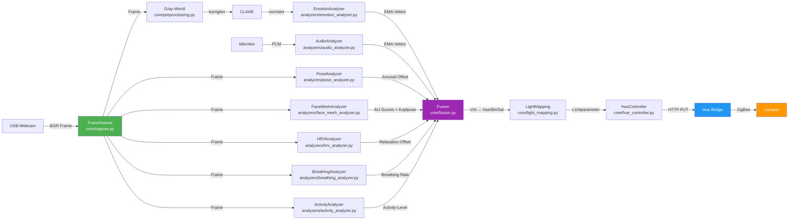

# Architektur – Smart Light

> Kurzüberblick für Entwickler. Für vollständige Spezifikation siehe [SPEC.md](SPEC.md).

## Datenfluss



## Modulübersicht

### core/ – Kernlogik

| Modul                  | Aufgabe                                                                |
| ---------------------- | ---------------------------------------------------------------------- |
| `capture.py`           | `FrameSource`-Klasse: Webcam- und Mock-Abstraktion                     |
| `fusion.py`            | Multimodale Offset-Fusion, zirkadianer VA→Licht, Transition-Berechnung |
| `session_log.py`       | JSONL-Session-Logging, Pseudonymisierung                               |
| `light_mapping.py`     | Emotion→Lichtparameter, Valence-Arousal→Hue/Bri/Sat                    |
| `hue_controller.py`    | Asynchroner Hue-Bridge-Sender mit Rate-Limiting                        |
| `preprocessing.py`     | Gray-World Color Constancy, Frame-Resize                               |
| `overlay.py`           | Debug-Overlay: Status- und Emotions-Anzeige auf dem Frame              |
| `calibration.py`       | Nutzer-Kalibrierung (individuelle Emotions-Offsets)                    |
| `circadian.py`         | Tageslicht-Rhythmus: automatische Farbtemperatur-Anpassung             |
| `emotion_regulator.py` | EMA-Smoothing über Emotionsvektoren                                    |
| `break_manager.py`     | Pausenerinnerungen basierend auf Sitzungsdauer                         |
| `cognitive_state.py`   | Kognitive Zustandsschätzung (Fokus, Müdigkeit)                         |
| `mode_manager.py`      | Betriebsmodus-Steuerung (Arbeit, Entspannung, Lesen)                   |

### analyzers/ – Sensorik-Threads

| Modul                   | Input     | Output               | Modell                  |
| ----------------------- | --------- | -------------------- | ----------------------- |
| `emotion_analyzer.py`   | Frame     | 7-Emotions-EMA       | DeepFace + RetinaFace   |
| `audio_analyzer.py`     | PCM-Audio | Audio-EMA + Prosodie | SpeechBrain/wav2vec2    |
| `pose_analyzer.py`      | Frame     | Arousal-Offset       | MediaPipe Pose          |
| `face_mesh_analyzer.py` | Frame     | AU-Scores, Kopfpose  | MediaPipe Face Mesh     |
| `hrv_analyzer.py`       | Frame     | Relaxation-Offset    | rPPG-Signalverarbeitung |
| `breathing_analyzer.py` | Frame     | Atemfrequenz         | Schulter-Tracking       |
| `activity_analyzer.py`  | Frame     | Aktivitätslevel      | Bewegungsanalyse        |

### main.py – Orchestrator

Zentrale Steuerung (~1400 Zeilen). Zuständig für:

- Initialisierung aller Analyzer-Threads
- Capture-Loop (30 FPS Target)
- Analyse-Dispatch (jeden n-ten Frame, Burst-Mode bei Konfidenzsprüngen)
- Aufrufe an `core/fusion.py` für Offset-Zusammenführung und Transition
- Session-Logging via `core/session_log.py`
- Overlay-Rendering und Hue-Update-Scheduling

## Threading-Modell

```
Main Thread     → Capture-Loop + Fusion + Hue-Steuerung + Overlay
                  (submit/get-Pattern für alle Analyzer)
Emotion Thread  → DeepFace Inference           [EmotionAnalyzer]
Audio Thread    → SpeechBrain + Mikrofon        [AudioEmotionAnalyzer]
Pose Thread     → MediaPipe Pose               [PoseEmotionAnalyzer]
FaceMesh Thread → MediaPipe Face Mesh + AUs    [FaceMeshAnalyzer]
HRV Thread      → rPPG-Verarbeitung            [HRVAnalyzer]
Breathing Thread→ Atemfrequenz-Schätzung       [BreathingAnalyzer]
Activity Thread → Bewegungsanalyse             [ActivityAnalyzer]
Hue Sender      → Bridge-HTTP-Writes (Queue)   [HueController]
```

Alle Analyzer implementieren das gleiche Interface:

- `submit(frame)` – nicht-blockierend, übergibt Frame an den Thread
- `get()` → `dict | None` – liefert das letzte Ergebnis (nicht-blockierend)

## Konfiguration

Zentral in `config.py` via Pydantic `BaseSettings` (Env-Prefix `SL_`).
Lokale Overrides in `config_local.py` (nicht versioniert).

## Benchmarks

Benchmark-Suite unter `benchmarks/reference_suite.py`:

- `--profile quick` → Preflight-Check (~5s)
- `--profile standard --enforce-gate` → CI-Gate
- `--profile strict --enforce-gate` → Release-Qualität
